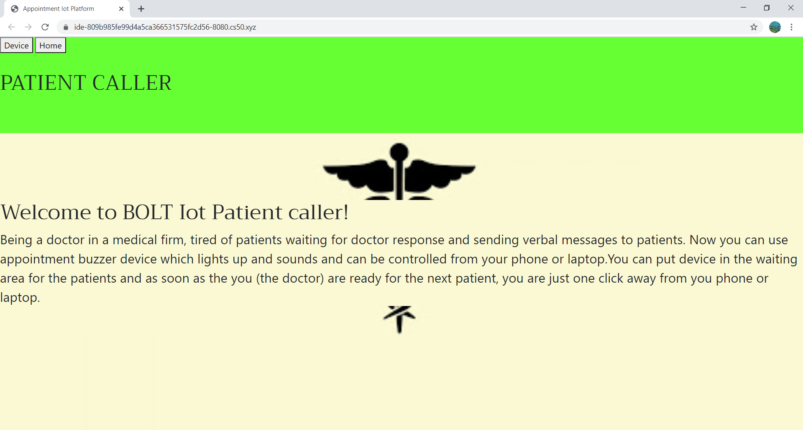

# PATIENT CALLER
#### Video Demo:  <https://youtu.be/Lxq9yEZuXSs>
#### Description:
Being a doctor in a medical firm, tired of patients waiting for doctor response and sending verbal messages to patients.
Now you can use appointment buzzer device which lights up and sounds and can be controlled from your phone or laptop.
You can put device in the waiting area for the patients and as soon as the you (the doctor) are ready for the next patient, you are just one click away from your phone or laptop.
This device is made for the puprose of making the communication between the doctor and the patient to be more efficient and less time consuming.
This project is made using BOLT IOT wifi module, programmed using flask and integerating it with bolt api.

## Bolt wifi module:
- WIFI MICROCONTROLLER MODULE provides an easy interface to quickly connect your hardware to cloud over GPIO, UART, and ADC. Also, connects to MODBUS, I2C, and SPI with an      additional converter.
- ROBUST COMMUNICATION
- Bolt is equipped with industry     standard protocols to ensure a   Secure and fast communication of your device data with the cloud.
- SECURITY: Bolt has built-in safeguards to secure all user data from unwanted third-party intrusions and hacks.

## Sofware:
Code in html, python

Usage of flask, bolt library, cs50 ide

## Hardware used:
- Bolt IoT Bolt WiFi Module
- LED
- Buzzer
- Jumper wires
- Bread board

### POST:
The on and off the button linked with the respective api action performs and leads to the turn on and off of the patient caller device respectively.

## API:
The sample of Bolt api:

```python
mybolt = Bolt(api_key, device_id)
data = mybolt.digitalWrite('0', 'HIGH')
            print (data)
data = mybolt.digitalWrite('0', 'LOW')
            print (data)

```

## Website outlook:




## references :
https://docs.boltiot.com/docs/sample-code

https://flask.palletsprojects.com/en/1.1.x/quickstart/#url-building

https://docs.boltiot.com/docs/introduction

https://cloud.boltiot.com/


## About CS50
CS50 is a openware course from Havard University and taught by David J. Malan

Introduction to the intellectual enterprises of computer science and the art of programming. This course teaches students how to think algorithmically and solve problems efficiently. Topics include abstraction, algorithms, data structures, encapsulation, resource management, security, and software engineering. Languages include C, Python, and SQL plus students’ choice of: HTML, CSS, and JavaScript (for web development).

Thank you for all CS50.